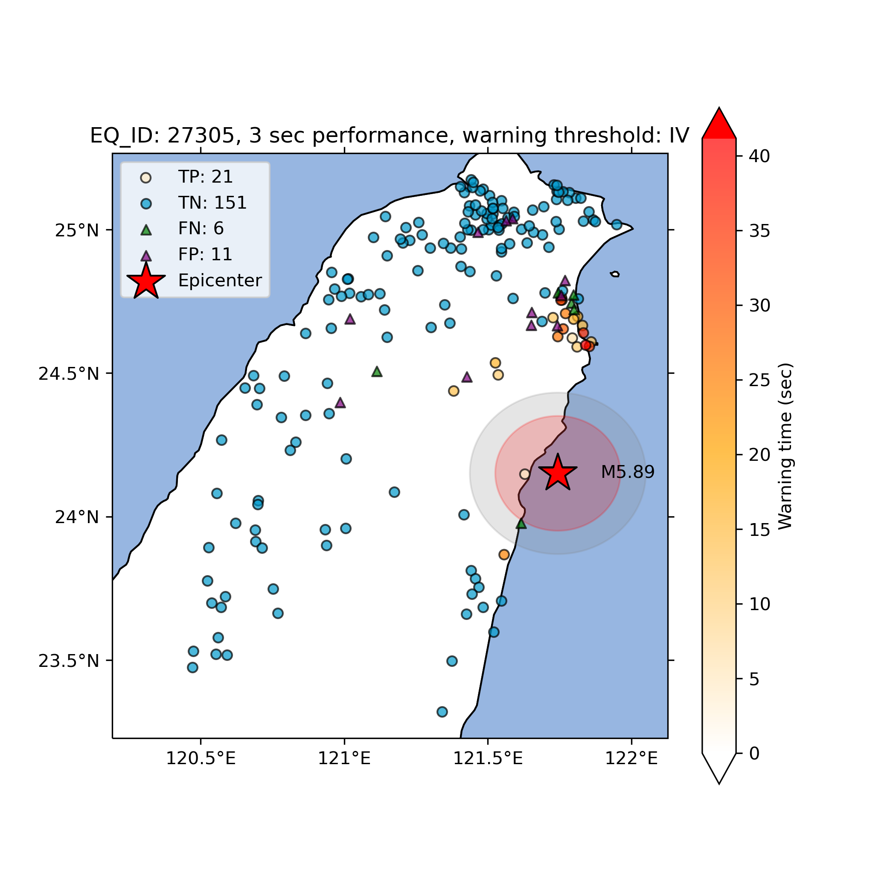

# TEAM_Taiwan

This is a deep learning model trying to implement EEW systems in Taiwan, data is contributed from TSMIP.

Model architecture include CNN, Transformer Encoder, Mixture Density Model

Reference: Münchmeyer et al.,2021 (https://academic.oup.com/gji/article/225/1/646/6047414)
## data preprocess

`read_tsmip.py`: functions of read file, picking, label

`afile.py`: classify events and records to csv file

`station location dataset.py`: merge TSMIP station locations

`catalog, records cleaning.py`: data cleaning (broken data, double events etc.)

`picking,label.py`: main files to picking and label(PGA or PGV)

`traces cutting.py`: summarize catalog and waveforms to hdf5 file

## Training model

`CNN_Transformer_Mixtureoutput_TEAM.py`: model architecture

`multiple_sta_dataset.py`: the class of pytorch dataset

`multi-station training.py`: main training file

## Prediction

`predict_new.py` `confusion matrix multi station.py` `plot_predict_map.py` `intensity map.py`

Calculate precision, recall, F1 score and calculate warthquake warning time

## Model performance

