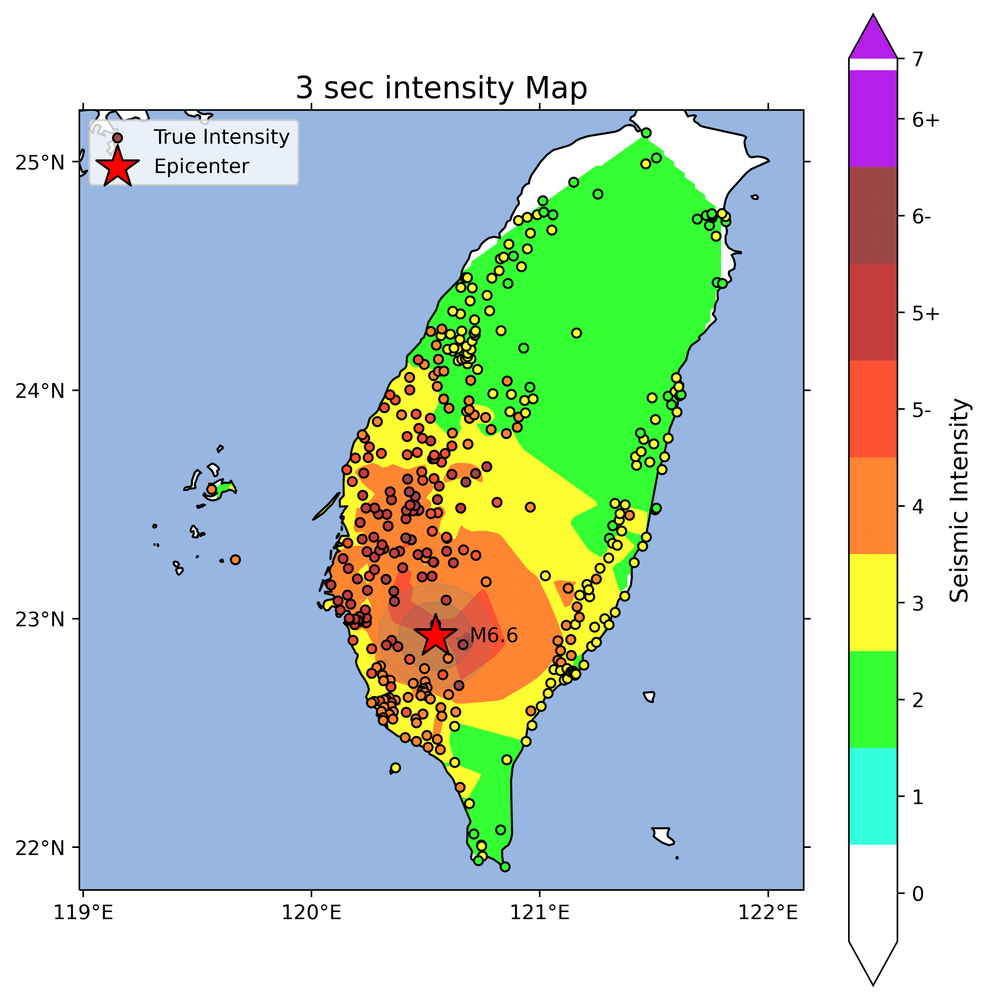
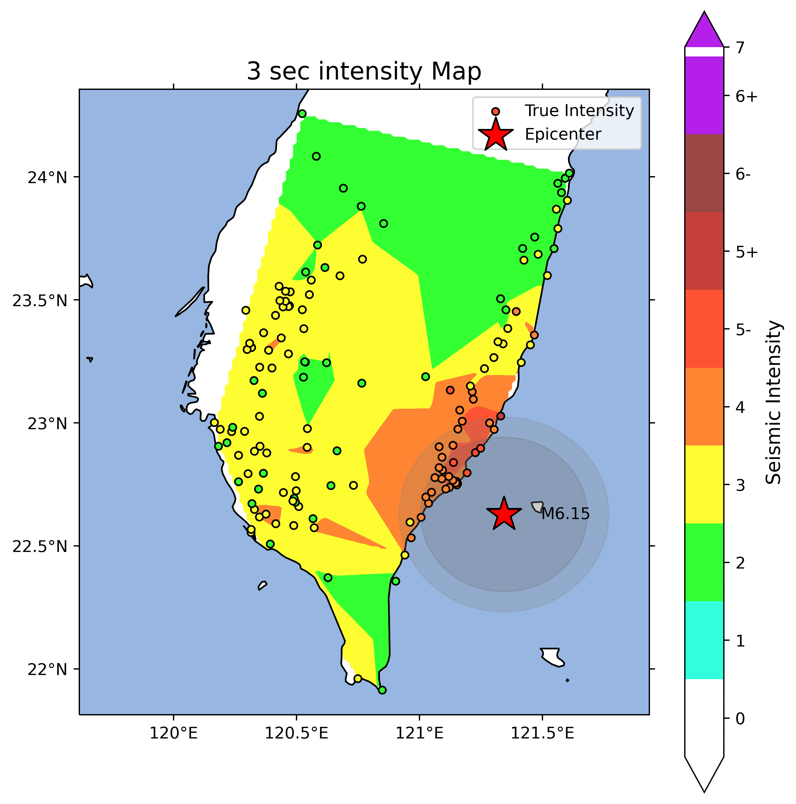

# Taiwan Transformer Shaking Alert Model (TT-SAM) 

This study has referenced the Transformer Earthquake Alerting Model (TEAM), a deep learning earthquake early warning (EEW) framework. We optimized the model using seismic data from Taiwan to develop the Taiwan Transformer Shaking Alert Model (TT-SAM), and it could rapidly calculate the seismic intensity to provide longer warning time.

## Data Preprocess

## Model architecture

## Model Performance

We use 2016 seismic data to evaluate model performance.

Seismic intensity threshold is from Central Weather Administration.

Background color represents model predicted intensity.

### 2016 Meinong Earthquake

### 2016 Taitung Offshore Earthquake

## References
Münchmeyer, J., Bindi, D., Leser, U., & Tilmann, F. (2021). The transformer earthquake
alerting model: A new versatile approach to earthquake early warning. Geophysical Journal
International, 225(1), 646-656.
(https://academic.oup.com/gji/article/225/1/646/6047414)

Liu, Kun-Sung, Tzay-Chyn Shin, and Yi-Ben Tsai. (1999). A free-field strong motion
network in Taiwan: TSMIP. Terrestrial, Atmospheric and Oceanic Sciences, 10(2), 377-396.
(http://tao.cgu.org.tw/index.php/articles/archive/geophysics/item/308)

Akazawa, T. (2004, August). A technique for automatic detection of onset time of P-and Sphases
in strong motion records. In Proc. of the 13th world conf. on earthquake engineering
(Vol. 786, p. 786). Vancouver, Canada.
(https://www.iitk.ac.in/nicee/wcee/article/13_786.pdf)

Kuo, C. H., Wen, K. L., Hsieh, H. H., Lin, C. M., Chang, T. M., & Kuo, K. W. (2012). Site
classification and Vs30 estimation of free-field TSMIP stations using the logging data of
EGDT. Engineering Geology, 129, 68-75.
(https://www.sciencedirect.com/science/article/pii/S0013795212000397)

Lee, C. T., & Tsai, B. R. (2008). Mapping Vs30 in Taiwan. TAO: Terrestrial, Atmospheric
and Oceanic Sciences, 19(6), 6.
(https://www.researchgate.net/profile/Chyi-Tyi-Lee-2/publication/250211755_Mapping_Vs30_in_Taiwan/links/557fa82608aeb61eae262086/Mapping-Vs30-in-Taiwan.pdf)

Huang, H. H., Wu, Y. M., Song, X., Chang, C. H., Lee, S. J., Chang, T. M., & Hsieh, H. H.
(2014). Joint Vp and Vs tomography of Taiwan: Implications for subduction-collision
orogeny. Earth and Planetary Science Letters, 392, 177-191.
(https://www.sciencedirect.com/science/article/pii/S0012821X14000995)

